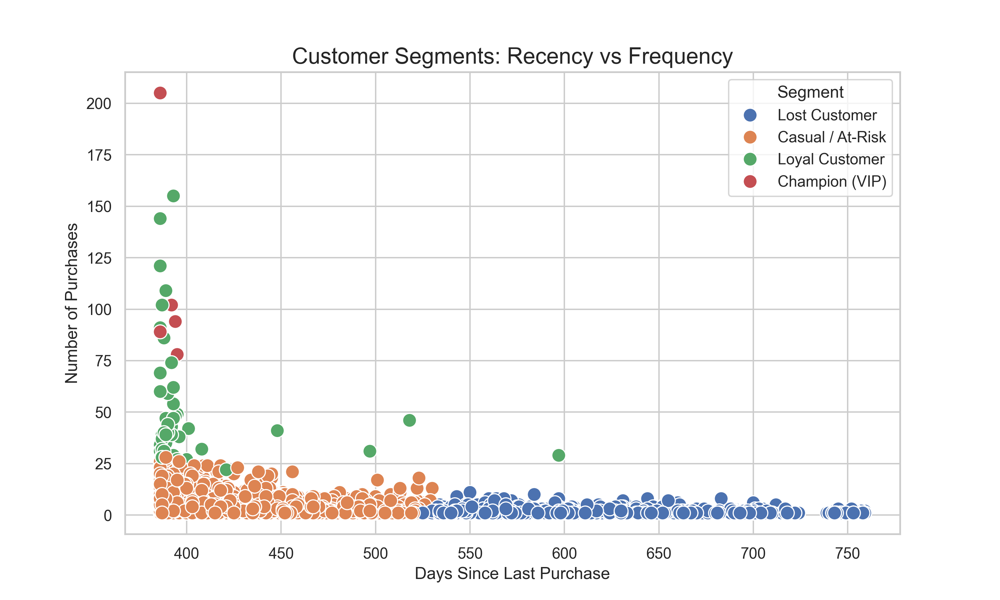

# Customer Segmentation & Churn Risk Analysis

## 📌 Project Overview
In this project, I analyzed a dataset of **500,000+ transactions** for a UK-based online retailer to identify distinct customer segments. The goal was to transform raw transaction data into actionable business insights using **RFM Analysis (Recency, Frequency, Monetary)** and **Unsupervised Machine Learning (K-Means Clustering)**.

## 🛠 Tools & Technologies Used
* **Python:** Pandas (Data Cleaning), Scikit-learn (Clustering), Matplotlib/Seaborn (Visualization)
* **SQL:** Data extraction, aggregation, and RFM calculation.
* **Power BI:** Dashboarding for stakeholder reporting.

## 📊 Key Findings
Using K-Means clustering, I identified 4 distinct customer groups:
1.  **Champions (VIPs):** High spenders who buy frequently. Strategy: Loyalty programs.
2.  **Loyal Customers:** Consistent buyers. Strategy: Upselling/Cross-selling.
3.  **At-Risk:** High past value but haven't purchased recently. Strategy: Win-back campaigns.
4.  **Lost/Low Value:** Low frequency and high recency.

## 📷 Visuals

## 🚀 How to Run
1.  Clone the repository.
2.  Install dependencies: `pip install pandas scikit-learn seaborn openpyxl`
3.  Run `sql_logic.py` to process the raw data.
4.  Run `clustering_logic.py` to generate the customer segments.
